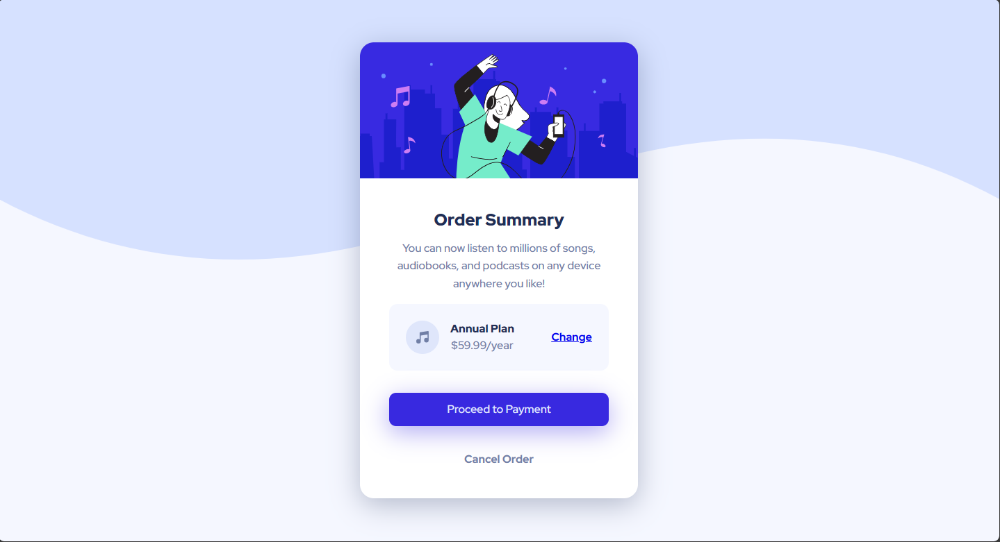
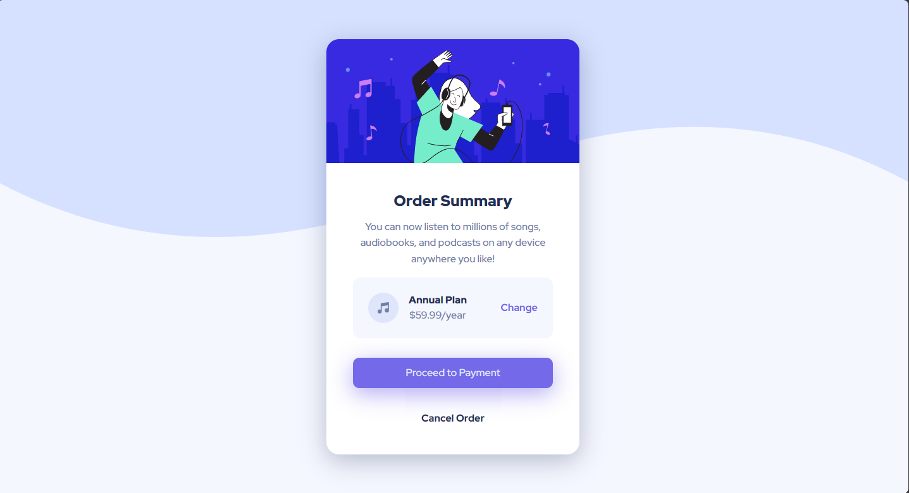

# Frontend Mentor - Order summary card solution

This is a solution to the [Order summary card challenge on Frontend Mentor](https://www.frontendmentor.io/challenges/order-summary-component-QlPmajDUj). Frontend Mentor challenges help you improve your coding skills by building realistic projects. 

## Table of contents

- [Overview](#overview)
  - [The challenge](#the-challenge)
  - [Screenshot](#screenshot)
  - [Links](#links)
- [My process](#my-process)
  - [Built with](#built-with)
  - [What I learned](#what-i-learned)
- [Author](#author)

## Overview

Hello everyone! 👋 I'm thrilled to present my solution to the Order summary card challenge from Front-end Mentor. ❤️ I'm eagerly awaiting your feedback!

### The challenge

Users should be able to:

- See hover states for interactive elements

### Screenshot

### Links

- Solution URL: [Add solution URL here](https://github.com/HosseinHeydarpour/order-summary-card)
- Live Site URL: [Add live site URL here](https://hosseinheydarpour.github.io/order-summary-card/)

## My process
In this project, I employed SASS for a more manageable codebase, and I adopted BEM methodology alongside it. For the overall layout, I used Flexbox.

### Built with

- Semantic HTML5 markup
- CSS custom properties
- Flexbox
- Desktop-first workflow

### What I learned

In this project i learned how to position background patterns for different screen sizes.

## Author

- Frontend Mentor - [@HosseinHeydarpour](https://www.frontendmentor.io/profile/HosseinHeydarpour)
- Linkedin - [@hosseinheydarpour](https://www.linkedin.com/in/hosseinheydarpour/)

